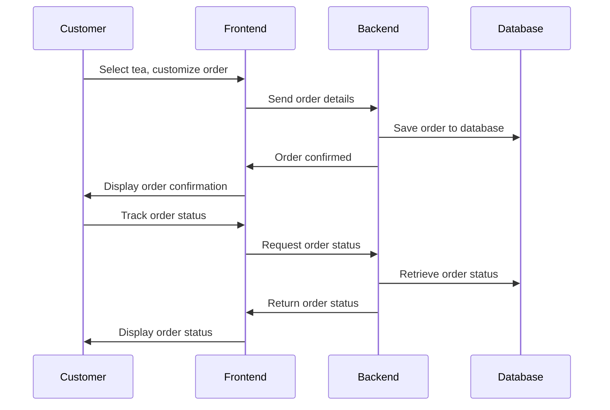

***Guowang Zeng***

## Introduction

Bubble tea, a popular drink originating from Taiwan, has gained global popularity over the years. With its customizable options, including different tea flavors, sweetness levels, and toppings, it has become a favorite among many. To streamline the ordering process and improve customer experience, we developed a Tea Ordering System for a bubble tea shop. This system leverages modern web technologies and frameworks to provide an intuitive and easy-to-use interface for customers, while also offering a backend to handle order management and status tracking.

The system allows customers to:
- Select tea type (e.g., green tea, black tea, oolong).
- Customize the sweetness and ice level.
- Choose from a variety of toppings (e.g., tapioca pearls, aloe vera, mango chunks).
- Track the status of their order (e.g., preparing, ready for pickup).

## Methodology

The system was designed with two main components: the front-end for customer interaction and the back-end for managing orders. The front-end is built using **React** for a responsive user interface, while the back-end utilizes **Node.js** and **Express** for handling API requests. The system uses a **MongoDB** database to store customer orders and statuses.

### Key Features:
- **Tea Customization**: Customers can choose the type of tea, sweetness level, ice level, and toppings.
- **Real-Time Order Tracking**: Customers can track the progress of their order (e.g., preparing, ready for pickup) through the user interface.
- **Backend API**: The back-end provides RESTful APIs for creating, updating, and retrieving order data.
- **Data Persistence**: All orders are stored in a MongoDB database to maintain persistent records of customer orders.

## System Architecture

The Tea Ordering System consists of the following components:
1. **Frontend (React)**: Provides the user interface for customers to interact with the system.
2. **Backend (Node.js/Express)**: Handles the business logic and manages customer orders.
3. **Database (MongoDB)**: Stores order data and customer information.

## Order Process Flow

The order process flow is simple and intuitive:
1. **Select Tea**: The customer selects a tea base (e.g., green tea, black tea).
2. **Customize Order**: The customer can adjust sweetness, ice level, and choose toppings.
3. **Submit Order**: After customization, the customer submits the order.
4. **Track Order**: The customer can track the status of their order in real-time (e.g., preparing, ready for pickup).

